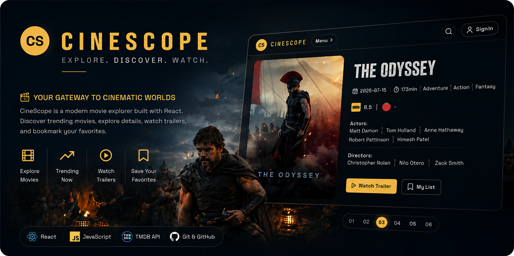
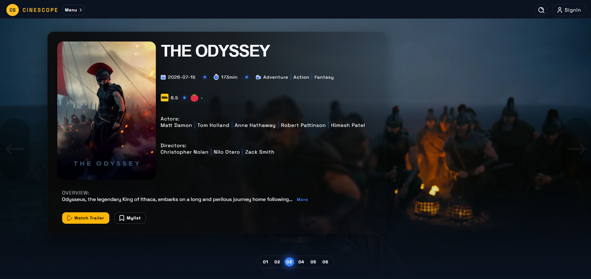
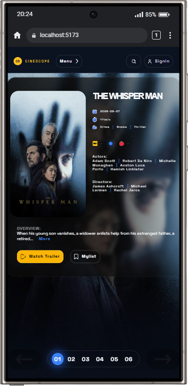

<div align="center">



<br />

# 🍿 CineScope

### Your gateway to cinematic worlds.

A modern and responsive movie application built with React that provides
real-time movies and tvseries information.

<br />

[](https://cine-scope-blond-ten.vercel.app/)
[](https://github.com/Hassan-src/CineScope)

</div>

---

## ✨ Overview

**CineScope** is a React-based movie application designed to provide users
with movies and tvseries information with the ability to save wanted movies.

The application allows users to explore movies and tvseries and view information such as:

- Release date
- Casts
- Genres
- Ratings
- Overview
- Watch trailers
- Bookmarking movies

The project focuses on building a polished frontend experience while
practicing real-world API integration, asynchronous data fetching,
React state management, reusable components, custom hooks, and responsive design.

---

## 🛠️ Tech Stack

<div align="center">

### Frontend


### Tooling


</div>

### Technologies

| Technology      | Purpose                                   |
| --------------- | ----------------------------------------- |
| ⚛️ React        | UI development and component architecture |
| 🟨 JavaScript   | Application logic                         |
| 🌐 HTML5        | Semantic structure                        |
| 🎨 CSS3         | Styling and responsive layouts            |
| ⚡ Vite         | Development server and production build   |
| 🔍 ESLint       | Code quality and linting                  |
| 🐙 Git & GitHub | Version control                           |

---

## 🏗️ React Architecture

The application uses reusable React components and separates responsibilities
between:

- UI components
- Custom hooks
- Context
- API services
- Application state

This architecture keeps the application modular and makes individual parts
easier to maintain and extend.

---

## 🖼️ Preview

### Desktop



### Mobile



---

## 🌐 API Integration

CineScope uses an external movie API to retrieve real-time movies information.

The API layer is isolated inside:

```text
src/services/api.js
```

The application then consumes that data through custom React Hooks.

```text
External Movie API
        ↓
src/services/api.js
        ↓
Custom React Hooks
        ↓
Context / Application State
        ↓
React Components
        ↓
User Interface
```

This architecture keeps API communication and data-fetching responsibilities
separate from UI components, making the application easier to maintain,
test, and extend.

---

## 📱 Responsive Design

CineScope is designed to work across different screen sizes.

The interface adapts to:

- 🖥️ Desktop
- 💻 Laptop
- 📱 Mobile
- 📟 Tablet

Responsive design is implemented using CSS media queries, flexible layouts,
and responsive components.

---

## ⚡ Loading & Error States

Network requests can take time or fail, so CineScope provides appropriate
application states.

### Loading

A skeleton loader is displayed while movies information is being retrieved.

### Error

If the API request fails, the application provides
an appropriate error state instead of leaving the interface blank.

---

## ♿ Accessibility

Accessibility was considered throughout the interface.

The project aims to provide:

- Semantic HTML
- Accessible form controls
- Visible interactive states
- Keyboard-friendly interactions
- Appropriate text contrast
- Responsive layouts
- Clear error feedback
- Meaningful labels

---

## 📂 Project Structure

```text
cinescope/
│
├── public/
│
├── src/
│   ├── components/
│   │   ├── Bookmark/
│   │   ├── Button/
│   │   ├── DifferentMovies/
│   │   ├── Error/
│   │   ├── Header/
│   │   ├── Hero/
│   │   ├── Loading/
│   │   ├── NavBar
│   │   ├── Series
│   │   ├── TextExpander
│   │   └── TrailerModal
│   ├── context/
│   │   ├── MovieContext.jsx
│   │   └── useMovieProvider.js
│   │
│   ├── hooks/
│   │   ├── useImdbRating.js
│   │   └── useLocalStorageState.js
│   │
│   │
│   ├── Pages/
│   │   ├── Bookmark/
│   │   ├── Home/
│   │   ├── Login/
│   │   ├── Movies/
│   │   ├── PageNotFound/
│   │   └── Series/
│   │
│   │
│   ├── services/
│   │   └── api.js
│   │
│   ├── utils/
│   │   └── image.js
│   │
│   ├── App.css
│   ├── App.jsx
│   ├── index.css
│   └── main.jsx
│
├── .env.example
├── .gitignore
├── eslint.config.js
├── index.html
├── package.json
├── vite.config.js
└── README.md
```

---

## 📦 Installation

### 1. Clone the repository

```bash
git clone https://github.com/Hassan-src/CineScope
```

### 2. Navigate to the project

```bash
cd cinescope
```

### 3. Install dependencies

```bash
npm install
```

### 4. Configure environment variables

Create a `.env` file:

```env
VITE_TMDB_TOKEN=your_api_token_here
VITE_OMDB_KEY=your_api_key_here
```

### 5. Start the development server

```bash
npm run dev
```

The application will then be available at the local development URL
provided by Vite.

---

---

## 🔮 Future Improvements

The current version focuses on the core movie experience.

Possible future improvements include:

- 📍 Dedicated page for each movie
- 🙍‍♂️ Signup Page
- ⛔ Logout Ability

---

## 📚 What I Learned

Building Nimbus helped me strengthen my understanding of:

- ⚛️ React component architecture
- 🪝 Custom React Hooks
- 🧠 Context API
- 🔄 Asynchronous JavaScript
- 🌐 REST API integration
- 📡 Fetching external data
- 📥 Caching data
- ⏳ Loading and error states
- 🔄 Conditional rendering
- 📱 Responsive CSS
- 🧩 Component composition
- 🗂️ Project organization
- 🔐 Environment variables
- ⚡ Vite development workflow
- 🔍 ESLint and code quality
- 🎨 Modern UI development

---

## 🎯 Project Goals

CineScope was created as a practical React project to move beyond simple
component exercises and work with a real external API.

The primary goals were to practice:

```text
React
  ↓
Component Architecture
  ↓
State Management
  ↓
Custom Hooks
  ↓
API Integration
  ↓
Async Data
  ↓
Loading & Error States
  ↓
Responsive UI
```

The project focuses on applying these concepts together to create a
complete, maintainable frontend application.

---

## 🚀 Deployment

CineScope is deployed using Vercel.

### Live Application

https://cine-scope-blond-ten.vercel.app/

### GitHub Repository

https://github.com/Hassan-src/CineScope

---

## 🤝 Contributing

Contributions, suggestions, and improvements are welcome.

### Fork the repository

```bash
git clone https://github.com/Hassan-src/CineScope.git
```

### Create a feature branch

```bash
git checkout -b feature/your-feature
```

### Commit your changes

```bash
git add .
git commit -m "Add your feature"
```

### Push your branch

```bash
git push origin feature/your-feature
```

Then open a Pull Request.

---

## 🐛 Issues & Suggestions

If you find a bug or have a suggestion for improving Nimbus,
feel free to open an issue on GitHub.

**GitHub Repository:**

https://github.com/Hassan-src/CineScope

---

## 🌐 Links

### 🚀 Live Demo

https://cine-scope-blond-ten.vercel.app/

### 💻 Source Code

https://github.com/Hassan-src/CineScope

### 🐙 GitHub

https://github.com/Hassan-src

---

## 👨‍💻 Developer

### Hassan Esmaeilpour

Frontend Developer passionate about building clean, interactive,
responsive web applications with React.

---

## ⭐ Support

If you like this project, consider giving the repository a ⭐ on GitHub.

---

<div align="center">

### 🍿 CineScope

**Your gateway to cinematic worlds.**

Built with ❤️ using React.
